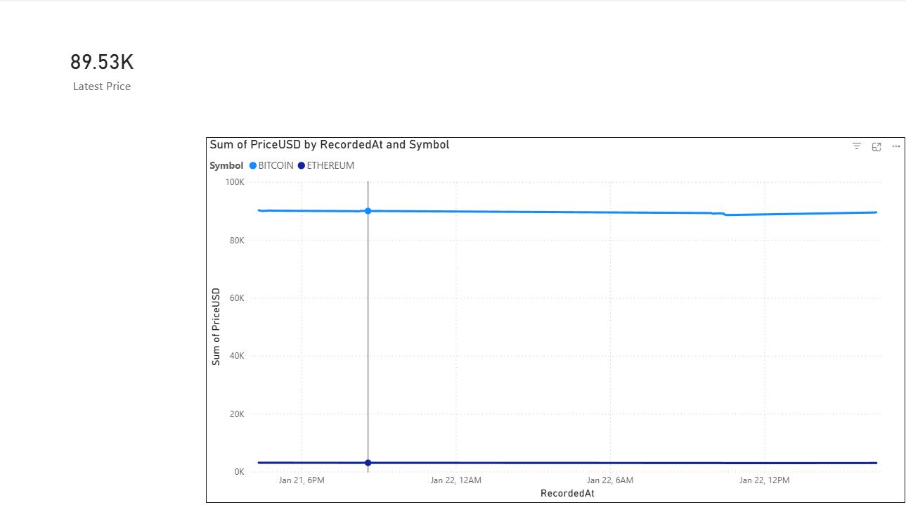

# Automated Crypto ELT Pipeline

## Project Overview
I built this end-to-end pipeline to move beyond static CSVs and handle real-time data engineering challenges. It extracts live cryptocurrency prices, warehouses them locally, and visualizes market volatility.

## 🛠 Tech Stack
* **Python:** Extractor script (`crypto_bot.py`) using `requests` & `pyodbc`.
* **SQL Server:** Local data warehouse with a custom schema for time-series data.
* **Power BI:** Dashboard with DAX measures (`CALCULATE`, `FILTER`) for real-time KPIs.

## ⚙️ Architecture
1.  **Extract:** Python hits the **CoinGecko API** every 60 seconds.
2.  **Load:** Data is normalized and pushed to **MSSQL** (MarketWatch DB).
3.  **Visualize:** Power BI updates via **DirectQuery** to show the latest trends.

## 🚀 How to Run
1.  Clone the repo.
2.  Install requirements: `pip install requests pyodbc`.
3.  Update the `DB_CONFIG` string in `crypto_bot.py` to match your SQL Server instance.
4.  Run `python crypto_bot.py`.
